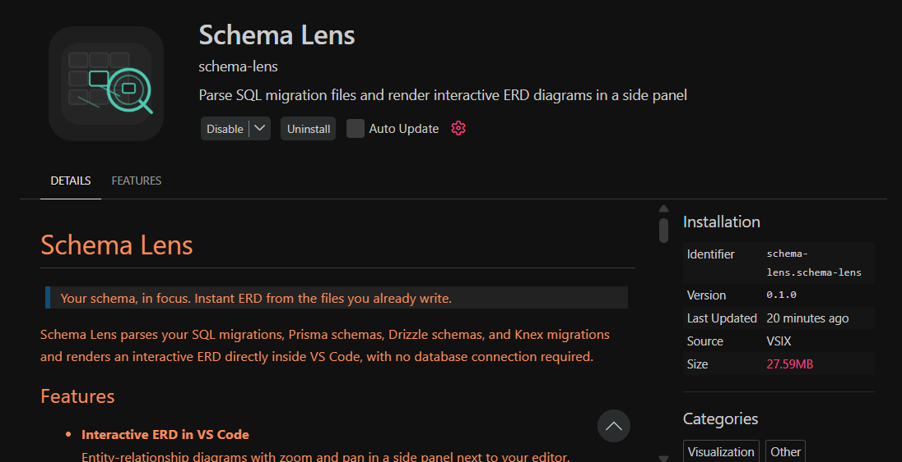

<div align="center">


# Schema Lens

**Your schema, in focus.**
*Instant ERD from the files you already write — right inside VS Code.*

[](#)
[](#-license)
[](#-contributing)
[](#)

<br/>



<br/>

> ⚠️ **Early-stage, vibe-coded, and evolving.** Expect rough edges.
> PRs and issues are very welcome — this is built in public.

</div>

---

## ≋ What is Schema Lens?

You know that moment when you're three files deep into a migration and you can no longer remember how `orders` relates to `line_items` without grep-ing through five files? Yeah. That's why this exists.

**Schema Lens** is a VS Code extension that reads your schema and migration files and renders an **interactive ERD** in a side panel. No browser tab. No SaaS login. No database connection. Just click **≋ View ERD** and see your schema.

```
  You have this:              Schema Lens gives you this:

  schema.prisma               ┌─────────────┐     ┌─────────────┐
  migrations/001.sql    ───▶  │  users      │────▶│  posts      │
  drizzle/schema.ts           │  PK id      │     │  PK id      │
                              │  email      │     │  FK author  │
                              │  name       │     │  title      │
                              └─────────────┘     └─────────────┘
```

---

## ✦ Why not just use [existing tool]?

Fair question. There are great ERD tools out there. Here's the honest comparison:

|  | Schema Lens | Browser-based tools | DB admin tools |
|---|:---:|:---:|:---:|
| Runs in VS Code | ✅ | ❌ | ❌ |
| No sign-up required | ✅ | mostly ❌ | ❌ |
| Works without a live DB | ✅ | sometimes | ❌ |
| Reads code directly | ✅ | upload/paste | ❌ |
| Zero external service | ✅ | ❌ | ❌ |
| Feature-complete modeling | ❌ | ✅ | ✅ |

Schema Lens isn't trying to replace those tools. It's the thing you reach for when you **already have a migration file open** and just want to *see* it, fast.

---

## ⚡ Features

- **≋ ERD on demand** — click one button in the editor title bar, get a diagram
- **Interactive canvas** — zoom, pan, drag nodes, hover columns for details
- **Multi-format parsing** — Prisma, Drizzle, Knex, and raw SQL (coverage growing)
- **Fully offline** — nothing leaves your machine
- **Zero config to start** — open a supported file, click the button, done
- **Schema diff** *(planned)* — compare two migrations visually

<details>
<summary><strong>📋 Supported formats</strong></summary>

<br/>

| Format | File patterns | Status |
|---|---|---|
| **Raw SQL** | `*.sql`, `migrations/*.sql` | ✅ Working |
| **Prisma** | `schema.prisma` | ✅ Working |
| **Drizzle ORM** | `*.ts` with `pgTable` / `mysqlTable` | ✅ Working |
| **Knex** | `*.ts` with `knex.schema.createTable` | ✅ Working |
| **TypeORM** | `*.entity.ts` | 🔜 Planned |
| **Sequelize** | `*.model.ts` | 🔜 Planned |

> Missing your stack? [Open an issue](../../issues) — parser contributions are especially welcome.

</details>

---

## 🚀 Installation

> **Not on the marketplace yet?** Skip to the `.vsix` instructions below.

**Option A — VS Code Marketplace:**

1. Open VS Code
2. Hit `Ctrl+Shift+X` (or `Cmd+Shift+X`)
3. Search **Schema Lens**
4. Click **Install**

**Option B — Install from `.vsix`:**

```bash
code --install-extension schema-lens-x.y.z.vsix
```

**Option C — Clone and run locally:**

```bash
git clone https://github.com/yourusername/schema-lens
cd schema-lens
npm install
# Press F5 in VS Code to launch the Extension Development Host
```

---

## 🎯 Usage

1. Open a folder containing your schema or migration files
2. Open any supported file (`schema.prisma`, `*.sql`, etc.)
3. Click **≋ View ERD** in the editor title bar
   — or run `Schema Lens: Open ERD` from the Command Palette (`Ctrl+Shift+P`)
4. The ERD panel opens to the side. Explore away.

```
  ┌──────────────────────────────────────────────┐
  │  project › migrations › schema.sql            │  ← breadcrumb
  │                                    [≋ ERD]    │  ← click this
  ├──────────────────────────────────────────────┤
  │  CREATE TABLE users (                         │
  │    id    SERIAL PRIMARY KEY,                  │
  │    email VARCHAR(255) UNIQUE NOT NULL          │
  │  );                                           │
  └──────────────────────────────────────────────┘
```

<details>
<summary><strong>⚙️ Configuration options</strong></summary>

<br/>

Configuration lives in your VS Code `settings.json`. Options are evolving — check the extension settings panel for the latest.

```jsonc
{
  // Paths to scan for schema/migration files
  "schemaLens.includePaths": ["./migrations", "./src/db"],

  // Explicitly set the parser (auto-detected by default)
  "schemaLens.parser": "auto", // "prisma" | "drizzle" | "knex" | "sql" | "auto"

  // How many tables to show before paginating the ERD
  "schemaLens.maxTablesPerView": 20
}
```

</details>

---

## 🗺️ Roadmap

> Tracked properly in [GitHub Issues](../../issues) and the project board — here's the high-level picture.

**Near-term** *(rough priority order):*

- [ ] TypeORM entity parser
- [ ] Schema diff between two files / commits
- [ ] Keyboard shortcuts for zoom and navigation
- [ ] Configurable themes (light mode, custom colors)

**Medium-term:**

- [ ] Jump-to-definition from ERD column → source file
- [ ] Better layout engine for large schemas (>20 tables)
- [ ] Multi-root workspace support

**Longer-term / exploratory:**

- [ ] GitHub Action to generate ERD PNGs on schema change
- [ ] Optional team diff viewer (potential paid add-on)

> Have an idea? [Open a discussion](../../discussions) rather than an issue if it's exploratory.

---

## 🤝 Contributing

Contributions are welcome — especially:

- 🐛 **Bug reports** with clear repro steps
- 🔌 **New parsers** for schema/migration formats not yet supported
- ⚡ **ERD performance** or layout improvements
- 📖 **Docs**, examples, and config samples

**Before opening a PR:**

1. Check [existing issues](../../issues) first
2. Open an issue describing what you want to change
3. Keep changes focused and minimal

> By contributing, you agree your work is licensed under the same terms as the project.

<details>
<summary><strong>🛠️ Dev setup</strong></summary>

<br/>

```bash
git clone https://github.com/yourusername/schema-lens
cd schema-lens
npm install

# Run tests
npm test

# Build the extension
npm run build

# Package as .vsix
npm run package
```

Press **F5** in VS Code to open an Extension Development Host with Schema Lens loaded.

**Main modules:**

```
src/
├── extension.ts       ← entry point, command registration
├── parsers/           ← one file per format (sql, prisma, drizzle, knex)
├── renderer/          ← webview HTML + ERD canvas logic
└── diff/              ← schema diff engine
```

</details>

---

## ⭐ Star History

If Schema Lens saves you even one *"wait, what was that foreign key again?"* moment — a star helps a lot. It makes the project more visible and keeps the motivation to ship.

[](https://star-history.com/#yourusername/schema-lens&Date)

> *Replace `yourusername` with your GitHub username for the star chart to work.*

---

## 📜 License

Schema Lens is **source-available under the [PolyForm Noncommercial 1.0.0](./LICENSE) license**.

**TL;DR:**

| Use case | Allowed? |
|---|:---:|
| Personal projects | ✅ Yes |
| Learning, studying the code | ✅ Yes |
| Open source projects (noncommercial) | ✅ Yes |
| Commercial products or services | ❌ Requires a separate license |
| SaaS built on top of Schema Lens | ❌ Requires a separate license |

This is intentionally *not* an OSI "open source" license — commercial use needs a separate agreement. This keeps the code public and accessible for personal use while letting me build something sustainable around it.

<details>
<summary><strong>🤔 Why PolyForm NC and not MIT?</strong></summary>

<br/>

The short version: I want the code to be readable, learnable, and usable for personal tooling without friction — but I also want the option to build something commercial around it without someone immediately wrapping it in a SaaS and undercutting it.

PolyForm Noncommercial is a clean, well-scoped license that achieves this. It's not hostile to individual developers or open source projects. If you're unsure whether your use case qualifies, just ask.

</details>

---

## ⚠️ Disclaimer

Schema Lens is provided **"as is"** — no warranties, no guarantees, no SLA. Use it at your own risk, especially in production or critical environments.

This README may lag behind the actual implementation. Treat it as a best-effort description, not a formal spec. When in doubt, read the source.

---

## 📬 Contact

| For what | Where |
|---|---|
| Bugs and feature requests | [GitHub Issues](../../issues) |
| Ideas and discussion | [GitHub Discussions](../../discussions) |
| Commercial licensing | [your@email.com — update this] |
| Just want to say hi | Same as above, that's fine |

---

<div align="center">

**Built in public · Vibe-coded with care · PRs welcome**

*If this saved you a grep, consider leaving a ⭐*

<br/>

 Made with ☕ by [Sangeeth](https://github.com/yourusername)

</div>
